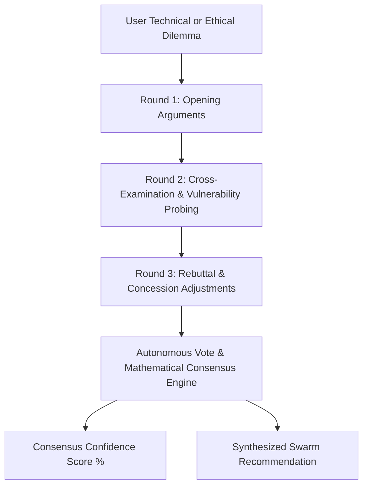

# Autonomous Multi-Agent AI Debate & Consensus Arena

[](https://fastapi.tiangolo.com/)
[](https://ollama.ai/)
[](https://github.com/JayNabasu)
[]()
[](LICENSE)
[](https://github.com/JayNabasu)

An autonomous multi-agent deliberation framework and interactive visual arena where four distinct AI personas engage in structured rounds of debate, cross-examine premises, challenge biases, and mathematically converge on actionable consensus recommendations.

---

## The Deliberation Personas

| Avatar | Persona | Title | Strategic Focus |
| :---: | :--- | :--- | :--- |
| 🏗️ | **Elena Vance** | *The Systems Architect* | Scalability, decouple boundaries, failure domains, and structural longevity. |
| 🔍 | **Marcus Croft** | *The Devil's Advocate* | Risk analysis, tail-risks, attack surfaces, cold-start latency, and hidden costs. |
| ⚖️ | **Dr. Aris Thorne** | *The Governance Ethicist* | Compliance, ISO/SOC2 auditability, algorithmic bias, and human impact. |
| ⚡ | **Kaelen Ross** | *The Pragmatic Operator* | Execution velocity, MVP validation, capital efficiency, and immediate ROI. |

---

## Deliberation Architecture & Flow



---

## Quick Start

### 1. Install Dependencies
```powershell
git clone https://github.com/JayNabasu/multi-agent-debate-arena.git
cd multi-agent-debate-arena
pip install -r requirements.txt
```

### 2. Run Automated Tests
```powershell
python -m pytest tests/test_arena.py
```

### 3. Start the Web Arena
```powershell
python -m uvicorn backend.server:app --reload --port 8000
```
Open **`http://localhost:8000`** to watch the autonomous personas deliberate and vote in real time.

---

## Author & Contact

**Jerry A. Nabasu**  
- **Role**: Automation & Digital Innovation Professional  
- **Specialty**: Multi-Agent Systems, Applied AI & Enterprise Architecture  
- **GitHub**: [@JayNabasu](https://github.com/JayNabasu)  
- **Email**: [jerrynabasu@gmail.com](mailto:jerrynabasu@gmail.com)
